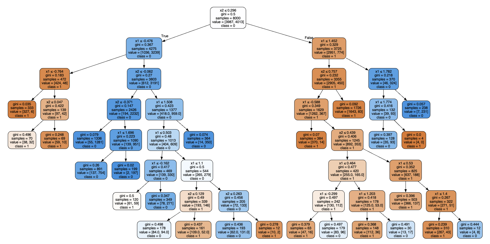

# Decision Trees: Hands-On Exercises from HOML (Chapter 6)
## Table of Contents
- [Project Goal](#project-goal)
- [Exercises](#exercises)
- [Solution Details](#solution-details)
- [Notebooks](#📒-notebooks)
- [Tech Stack](#💻-tech-stack)
- [Lessons Learnt](#🏫-lessons-learnt)
- [About Me](#🚀-about-me)
- [Links](#🔗-links)
- [Skills](#🛠-skills)

## 🎯 Project Goal
The main goal of this project is to practice and solve exercise problems from `Chapter 6 - Decision Trees` in `Hands-On Machine Learning with Scikit-Learn, Keras, and TensorFlow`. This project aims to deepen understanding of decision tree algorithms, hyperparameter tuning, and ensemble learning by implementing practical exercises.

---

## Exercises

### Exercise 1
- Trained and fine-tuned a `DecisionTreeClassifier` on the moons dataset, achieving an `f1` score of 0.87 using hyperparameter tuning with `GridSearchCV`.

### Exercise 2
- Manually built a random forest to experiment with ensemble learning. While the manually constructed forest provided a valuable learning experience, it did not significantly improve the `f1` score over a single decision tree.

---

## ✅ Solution Details

### Exercise 1
- Trained a simple `DecisionTreeClassifier` and experimented using `GridSearchCV` to get optimized parameters, achieving an `f1` score of 0.87.

#### Visualization
Visualization of the decision tree structure for Exercise 1, showing splits and leaf nodes:  

### Exercise 2
- Manually created a random forest and experimented with different forest sizes and densities to find the best classification model.
- Unfortunately, the `RandomForest` did not significantly improve the `f1` score.

---

## 📒 Notebooks
- [Exercise 1](https://github.com/gaurangdave/homl_decision_trees/blob/main/notebooks/exercise_1.ipynb)
- [Exercise 2](https://github.com/gaurangdave/homl_decision_trees/blob/main/notebooks/exercise_2.ipynb)

---

## 💻 Tech Stack

  
  
  
  
  

---

## 🏫 Lessons Learnt
1. **Machine Learning Concepts**:
   - Gained a deeper understanding of the `DecisionTree` classification algorithm, its hyperparameters, and their impact on model performance.
   - Explored `RandomForests` to understand how ensemble learning combines multiple weak learners to improve performance.

---

## 🚀 About Me

An experienced software engineer with 15 years in full-stack development, scalable architectures, and elegant design. Now pivoting to AI/ML, blending extensive experience with curiosity to explore cutting-edge solutions.

---

## 🔗 Links

  

---

## 🛠 Skills

`Python`, `Jupyter Notebook`, `scikit-learn`, `FastAPI`, `Plotly`, `Conda`